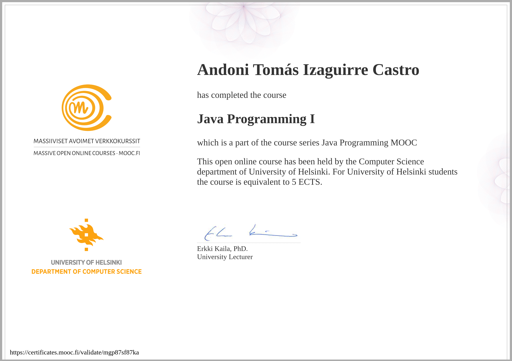
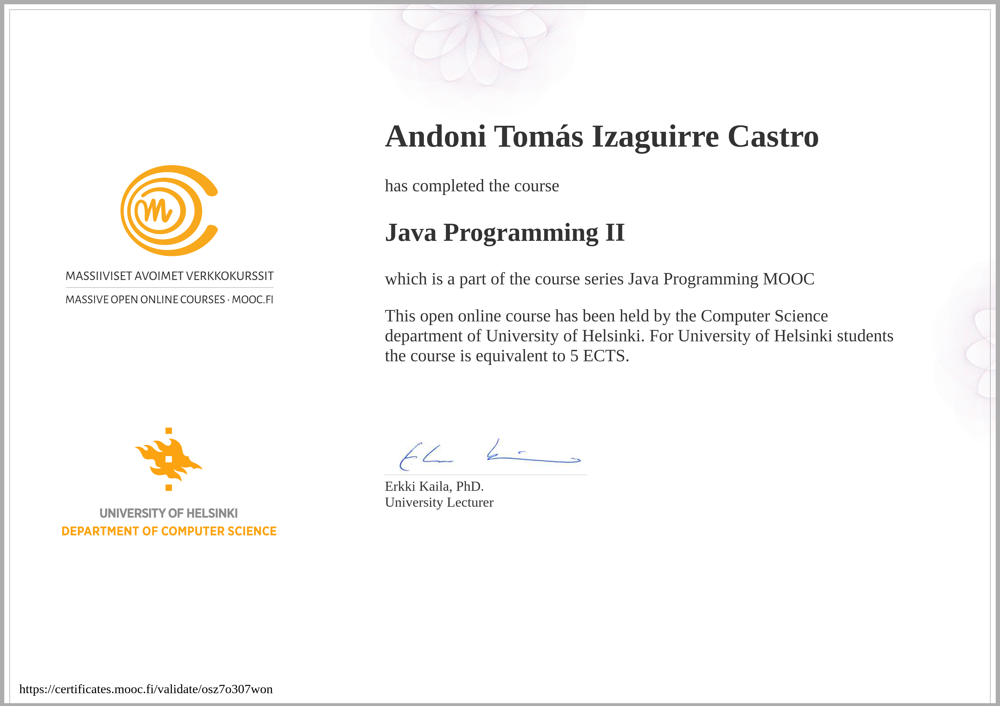

# Java Programming - MOOC.FI
This repository contains all my solutions to the exercises required for the [Java Programming](https://java-programming.mooc.fi/) course given by the University of Helsinki. It includes both Java Programming I and Java Programming II courses.

The structure of this repository is as follows:
- Java Programming I
  - Part 1
  - Part 2
  - Part 3
  - Part 4
  - Part 5
  - Part 6
  - Part 7
- Java Programming II
  - Part 8
  - Part 9
  - Part 10
  - Part 11
  - Part 12
  - Part 13
  - Part 14
 
Thanks to University of Helsinki for this excellent course.

[Java Programming I Certificate](https://certificates.mooc.fi/validate/mgp87sf87ka)

[Java Programming II Certificate](https://certificates.mooc.fi/validate/osz7o307won)

